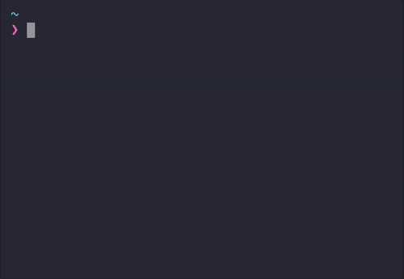
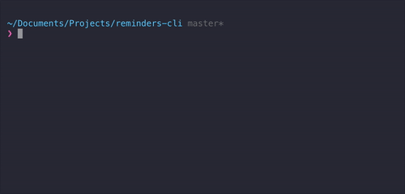
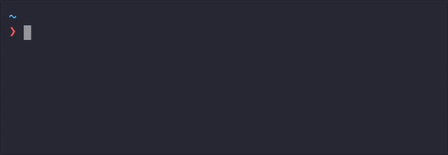

<p align="center"> 

</p>

<h1 align="center">reminders-cli</h1>
<p align="center">
  Command-line interface to interact with the Reminders.app.
</p>

## Getting started

### Usage

```console
$ reminders-cli --help

    Command-line utility to handle reminders on Mac OSX.

    Options:
      --list      List all reminders that are not completed
      --add       Create a new reminder
      --complete  Complete a reminder
      --version   Package version
```

### Create

reminders-cli uses natural language processing to parse and then create the reminders.

```console
$ remind me to feed the cats tomorrow at 9
```


> You can see some examples in the [date parsing test file](https://github.com/lucasbento/reminders-cli/blob/master/src/utils/__tests__date.spec.js#5).

### List

```console
$ reminders-cli --list
```



### Complete

```console
$ reminders-cli --complete
```



> 🔥 It's also possible to provide a name (or part of) to `complete` command:



### Installation

This package requires NodeJS to be installed.

#### Homebrew
```console
brew install node
```

#### Manual
Go to [https://nodejs.org/en/download/](https://nodejs.org/en/download/) and install the latest LTS version.

### Installing the package
```console
npm install -g reminders-cli
```

## Development

1. Install
```console
yarn # or npm install
```

2. Run build with auto-reloading
```console
yarn run watch
```

3. Try commands
```console
node ./dist/index.js --list # To list reminders
node ./dist/index.js --add "My reminder" 11/11/2017 10:30
node ./dist/index.js --add "My reminder"
```
