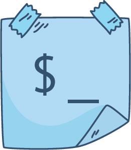

# [](#)

# reminders-cli

## Getting started

### Installation

This package requires NodeJS to be installed.

#### Homebrew
```console
brew install node
```

#### Manual
Go to [https://nodejs.org/en/download/](https://nodejs.org/en/download/) and install the latest LTS version.

#### Installing the package
```console
yarn global add reminders-cli
```

### Usage

```console
$ reminders-cli --help

    Command-line utility to handle reminders on Mac OSX.

    Options:
      --list  List all reminders that are not completed.
      --add   Create a new reminder.
```

### List

```console
$ reminders-cli --list
```

### Add

```console
$ reminders-cli --add "My reminder" 11/11/2017 10:30
```

> The parameters `name`, `date` and `time` can be omitted and will be provided as follows:

## Development

1. Install
```console
yarn # or npm install
```

2. Run build with auto-reloading
```console
yarn run watch
```

3. Try commands
```console
node ./dist/index.js --list # To list reminders
node ./dist/index.js --add "My reminder" 11/11/2017 10:30
node ./dist/index.js --add "My reminder"
```